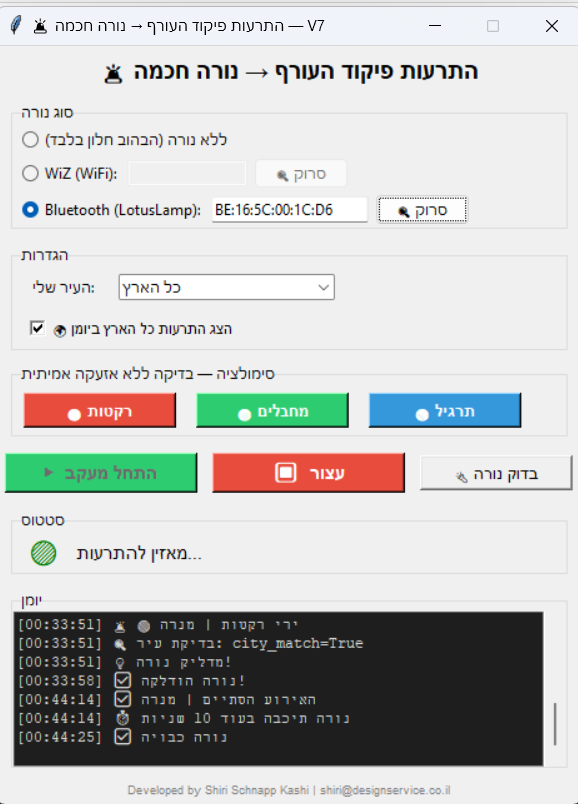

# 🚨 OrefWiz Alert — V3
### מערכת התרעות חזותית לחירשים וכבדי שמיעה

> Developed by **Shiri Schnapp Kashi**

[](LICENSE)
[](https://www.python.org/)
[]()

---

## 💡 הרעיון

מה קורה לאדם חירש או כבד שמיעה כשהאזעקה מופעלת בלילה?  
הוא ישן. הוא לא שומע. הזמן רץ.

**OrefWiz** מתחברת ל-API של פיקוד העורף ועם כל התרעה — שולחת פקודה לנורת LED חכמה לשנות צבע ולהבהב.

---

## 🎨 צבעים לפי סוג ההתרעה

| סוג | צבע |
|-----|-----|
| 🔴 ירי רקטות וטילים | אדום בוהק |
| 🟢 חדירת מחבלים | ירוק בהיר |
| 🟠 חדירת כלי טיס | כתום |
| 🔴 פיגוע | אדום |
| 🟣 רעידת אדמה | סגול *(כבוי כברירת מחדל)* |
| 🔵 צונאמי | כחול *(כבוי כברירת מחדל)* |
| 🟡 אירוע כימי | צהוב *(כבוי כברירת מחדל)* |
| 🟢 חומרים רדיואקטיביים | ירוק *(כבוי כברירת מחדל)* |

---

## 🛒 מה צריך לקנות

נורת **WiZ RGB E27** — נמכרת בבאג, Bug, iDigital בכ-80 ש"ח.  
פשוט מברגים אותה לכל מנורה רגילה עם שקע E27.

---

## ⚡ התקנה

```bash
pip install pywizlight requests
python oref_wiz_gui_v3.py
```

---

## ⚙️ הגדרה

1. פתח את האפליקציה
2. הכנס את **IP הנורה** — נמצא באפליקציית WiZ ← Settings ← Device IP
3. הכנס את **שם העיר שלך בעברית** (לדוגמה: `אום אל-פחם`, `תל אביב - מרכז העיר`)
4. לחץ **התחל מעקב**

---

## 🔧 הפעלה אוטומטית עם Windows

כדי שהאפליקציה תעלה אוטומטית עם Windows:

1. לחץ `Win + R` ← הקלד `shell:startup`
2. צור קובץ `oref_alert.bat`:
```batch
@echo off
pythonw "C:\path\to\oref_wiz_gui_v3.py"
```

---

## ⚠️ הערות חשובות

- ה-API של פיקוד העורף **זמין רק מישראל**
- הנורה והמחשב חייבים להיות **באותה רשת WiFi**
- המחשב חייב להיות **דלוק ומחובר** כדי שהמערכת תעבוד

---

## 🤝 שיתוף פעולה

אני מזמין את **אגודת החירשים בישראל (אח"א)** ואת **פיקוד העורף** לראות את הפרויקט ולשתף פעולה.  
הטכנולוגיה כבר קיימת — נשאר רק לגשר על הפער.

📧 **shiri@designservice.co.il**

---

## 📄 רישיון

MIT — קוד פתוח, חינמי, זמין לכולם.
